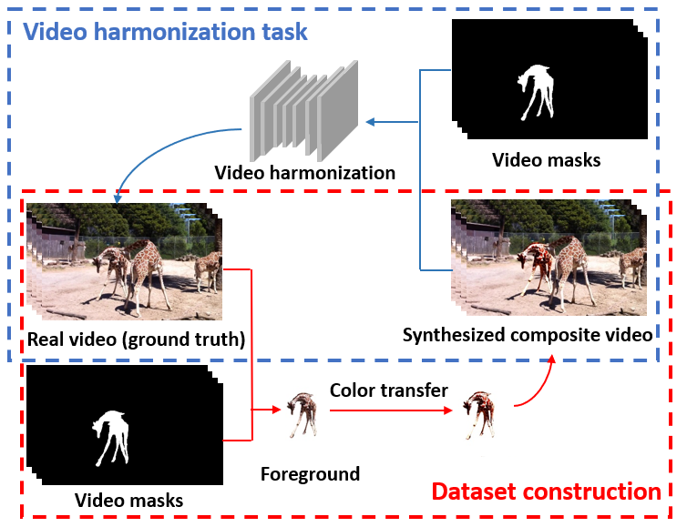

## Video-Harmonization-Dataset-HYouTube

The  figure below depicts dataset construction process (red arrows) and video harmonization task (blue arrows).

**Dataset Construction Process:** Our dataset **HYouTube** is based on [Youtube-VOS-2018](https://youtube-vos.org/challenge/2018/). Given real videos with object masks, we adjust their foregrounds using Lookup Tables (LUTs) to produce synthetic composite videos. We employ in total 100 candidate LUTs, in which one LUT corresponds to one type of color transfer. 
Given a video sample, we first select a LUT from 100 candidate LUTs randomly to transfer the foreground of each frame. The transferred foregrounds and the original backgrounds form the composite frames, and the composite frames form composite video samples. We provide the script XXX to generate composite video based on real video, foreground mask, and LUT.
Our dataset includes 3194 pairs of synthetic composite video samples and real video samples, which are split to 2558 training pairs and 636 test pairs. Each video sample contains 20 consecutive frames with the foreground mask for each frame.  Our HYouTube dataset can be downloaded from [**Baidu Cloud**] (). 

**Video Harmonization Task:** Given a composite video and the foreground mask, video harmonization task aims to adjust the foreground to make it compatible with the background, resulting in a more realistic composite video. 




## Real Composite Videos

Besides, we also synthesize  real  composite videos.  We collect  video  foregrounds  with  masks from  a  video  matting  dataset  [XXX]()  as  well  as video backgrounds from [Vimeo-90k Dataset]()  and  Internet.  Then,  we  create  composite  videos  via copy-and-paste and finally select 100 composite videos which look reasonable w.r.t. foreground  placement  but  inharmonious w.r.t. color/illumination.  100 real composite videos can be downloaded from [**Baidu Cloud**] ().


## Getting Started

### HYoutube File Structure
- Download the HYoutue dataset. We show the file structure below:

  ```
  ├── Composite: 
       ├── videoID: 
                ├── objectID
                          ├── imgID.jpg
                
                ├── ……
       ├── ……
  ├── Mask: 
       ├── videoID: 
                ├── objectID
                          ├── imgID.png
                
                ├── ……
       ├── ……
  ├── Ground-truth: 
       ├── videoID: 
                ├── imgID.jpg
       ├── ……
  ├── train.txt
  └── test.txt
  └── transfer.py
  ```
  
### Apply Transfer
#### Prerequisites

